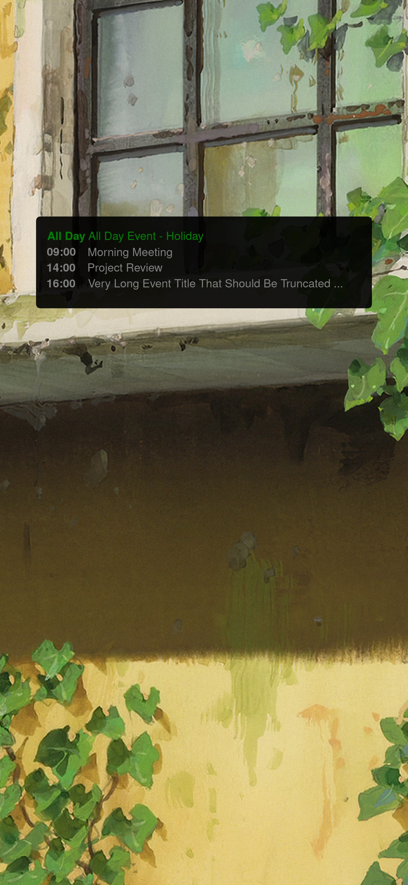

# iPhone Lockscreen Calendar Generator

Transform your iPhone lockscreen into a dynamic calendar display that automatically updates with your daily events. This tool generates beautiful lockscreen wallpapers by overlaying your calendar events onto custom background images and automatically uploading them to AWS S3.



*Example lockscreen showing today's calendar events overlaid on a custom background*

## Features

- **Automatic Daily Updates**: Runs every 30 minutes to keep your lockscreen current
- **Multi-Calendar Support**: Combines events from multiple iCal feeds (Google Calendar, Outlook, etc.)
- **Smart Background Selection**: Deterministically selects a different background image each day
- **Timezone Aware**: Properly handles timezones to show the correct day's events
- **Customizable Layout**: Configurable text positioning, colors, and display options
- **Cloud Integration**: Automatically uploads to AWS S3 for easy access across devices
- **Docker Ready**: Complete containerized solution for reliable deployment

## How It Works

1. **Fetches Events**: Retrieves today's calendar events from your configured iCal feeds
2. **Selects Background**: Chooses a background image based on the current date (same image all day)
3. **Generates Lockscreen**: Overlays calendar events in a clean, readable format
4. **Uploads to Cloud**: Saves the final image to your AWS S3 bucket
5. **Sets as Wallpaper**: Use the S3 URL to set as your iPhone lockscreen

## Quick Start

### Option 1: Docker (Recommended)

1. **Clone the repository**
   ```bash
   git clone https://github.com/your-username/iphone_lockscreen_calendar.git
   cd iphone_lockscreen_calendar
   ```

2. **Configure your settings**
   ```bash
   cp inputs/config.toml.example inputs/config.toml
   # Edit config.toml with your AWS credentials and calendar URLs
   ```

3. **Add background images**
   ```bash
   # Place your PNG background images in inputs/backgrounds/
   cp your-backgrounds/*.png inputs/backgrounds/
   ```

4. **Start the container**
   ```bash
   docker-compose up -d
   ```

5. **Monitor the logs**
   ```bash
   docker-compose logs -f
   ```

Your lockscreen will be available at: `https://your-bucket.s3.amazonaws.com/lockscreen.jpg`

### Option 2: Local Development

1. **Install dependencies**
   ```bash
   # Requires Python 3.11+ and uv package manager
   uv sync
   ```

2. **Configure settings**
   ```bash
   cp inputs/config.toml.example inputs/config.toml
   # Edit with your credentials and preferences
   ```

3. **Run manually**
   ```bash
   uv run python main.py
   ```

## Configuration

All settings are managed through `inputs/config.toml`:

```toml
[display]
iphone_height_px = 2796
iphone_width_px = 1290

[aws]
access_key_id = "your-aws-access-key"
secret_access_key = "your-aws-secret-key"
bucket_name = "your-s3-bucket"

[timezone]
timezone = "Australia/Brisbane"

[[calendars]]
url = "https://calendar.google.com/calendar/ical/your-calendar/basic.ics"
color = "green"
name = "Personal"

[[calendars]]
url = "https://outlook.live.com/owa/calendar/your-calendar.ics"
color = "red"
name = "Work"
```

## Setting Up Your iPhone

1. **Get your lockscreen URL**: `https://your-bucket.s3.amazonaws.com/lockscreen.jpg`
2. **Open in Safari** on your iPhone
3. **Save to Photos** (hold image → Save to Photos)
4. **Set as Wallpaper** (Settings → Wallpaper → Choose New Wallpaper)

Or use the Shortcuts app to automate this process!

## Customization

### Background Images
- Place PNG files in `inputs/backgrounds/`
- Images are automatically cropped to iPhone dimensions
- One image is selected per day (deterministic by date)

### Text Styling
Customize colors, fonts, and positioning in `config.toml`:
```toml
[text]
font_size = 28
box_color = [0, 0, 0, 180]  # Semi-transparent black
padding = 20

[layout]
box_top_position = 0.65  # Position from top (0.0-1.0)
```

### Calendar Colors
Each calendar feed can have its own color for visual distinction:
```toml
[[calendars]]
url = "https://your-calendar.ics"
color = "green"  # or "red", "blue", etc.
```

## Development

### Project Structure
```
├── main.py                 # Core application logic
├── inputs/
│   ├── config.toml        # Configuration file
│   └── backgrounds/       # Background images (PNG)
├── tests/                 # Test suite
├── Dockerfile            # Container definition
└── docker-compose.yml    # Deployment configuration
```

### Running Tests
```bash
uv run pytest tests/
```

### Adding Dependencies
```bash
uv add package-name
```

## Docker Deployment

The Docker setup provides a complete, automated solution:

- **Scheduled Execution**: Runs every 30 minutes via cron
- **Health Monitoring**: Built-in health checks and logging
- **Persistent Storage**: Volumes for logs and configuration
- **Easy Updates**: Simple rebuild and restart process

See [DOCKER.md](DOCKER.md) for detailed deployment instructions.

## Contributing

We welcome contributions! Here's how you can help:

### Bug Reports
- Use the [Issues](https://github.com/your-username/iphone_lockscreen_calendar/issues) tab
- Include your configuration (remove sensitive data)
- Provide error logs and expected behavior

### Feature Requests
- Check existing issues first
- Describe the use case and benefit
- Consider submitting a pull request

### Development Setup
1. Fork the repository
2. Create a feature branch: `git checkout -b feature-name`
3. Make your changes and add tests
4. Ensure tests pass: `uv run pytest`
5. Submit a pull request

### Areas for Contribution
- **Additional Calendar Providers**: Support for more calendar services
- **Text Formatting**: Rich text, emoji support, better typography
- **Background Effects**: Blur, gradients, dynamic backgrounds
- **Notification Integration**: iOS Shortcuts, push notifications
- **Web Interface**: Configuration UI, preview generation

## License

This project is licensed under the MIT License - see the [LICENSE](LICENSE) file for details.

## Acknowledgments

- Built with [Python](https://python.org) and [matplotlib](https://matplotlib.org)
- Calendar parsing via [recurring-ical-events](https://github.com/niccokunzmann/recurring-ical-events)
- Containerized with [Docker](https://docker.com)
- Package management by [uv](https://github.com/astral-sh/uv)

## Support

- **Documentation**: Check [DOCKER.md](DOCKER.md) for deployment help
- **Issues**: Use GitHub Issues for bug reports and questions
- **Discussions**: Share your lockscreen creations and tips

---

**Made with care for iPhone users who love staying organized**